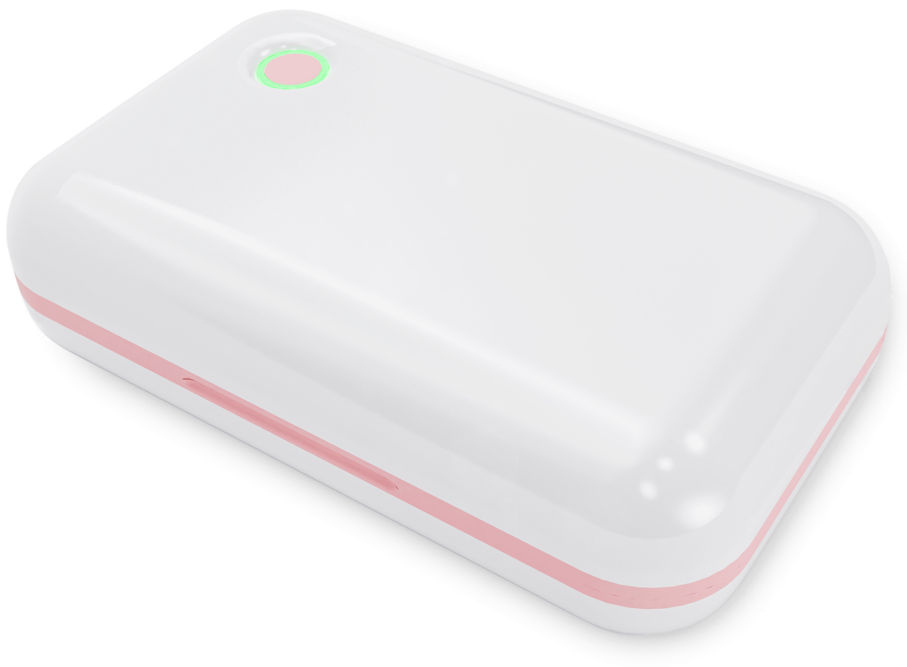
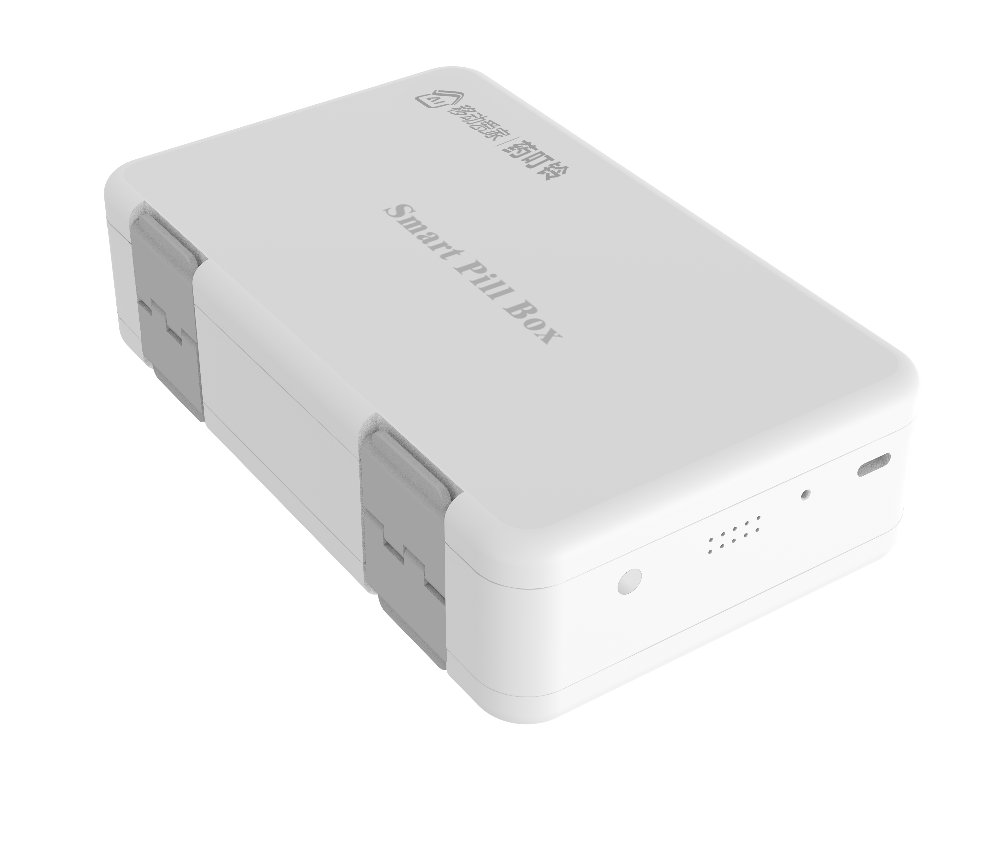

# 移动爱家药叮铃智能药盒 AI SKILL

> 让 AI 守护家人用药健康

[]()
[](LICENSE)
[]()

---

## 📖 项目简介

这是**移动爱家药叮铃智能药盒**的官方 AI Skill 仓库。通过本 Skill，AI 助手可以：

- 🎯 解答产品咨询和选购建议
- 📱 指导 APP 绑定和配网操作
- ⚙️ 协助配置用药提醒计划
- 🔧 排查常见故障和问题
- 📞 提供售后服务支持

---

## 🏥 关于药叮铃

**药叮铃**是广东沅朋网络科技有限公司旗下的智能药盒品牌，专注解决"忘记吃药"这一老年人常见痛点。

### 核心功能

| 功能 | 说明 |
|------|------|
| ⏰ 定时提醒 | 到点语音+灯光双重提醒 |
| 📋 用药计划 | 支持多药品、多频次管理 |
| 👨‍👩‍👧 家属联动 | 子女远程查看父母服药情况 |
| 🔋 超长续航 | 一次充电使用数周 |
| 📶 多种联网 | 蓝牙/WiFi/4G 三种版本 |

---

## 📦 产品系列

### P100 蓝牙基础版
适合个人使用，通过微信小程序管理



### P700 WiFi智能版 ⭐推荐
适合家庭使用，移动爱家APP深度集成，支持远程查看


### P800 4G独立版
适合独居老人，插入SIM卡即可独立联网



---

## 🚀 快速开始

### 最简单的方式：告诉你的 AI 助手

直接拷贝下面这句话发给你的 AI 助手：

```
帮我安装药叮铃智能药盒 Skill，仓库地址：https://github.com/gdyuanpeng/cmcc-yaodingling-skill
```

Agent 会自动克隆仓库并安装到对应的 Skill 目录。

### 其他安装方式

#### 手动克隆到 Skill 目录

将本仓库克隆到不同 IDE 对应的 Skill 目录：

| IDE | Skill 目录 |
|-----|-----------|
| CodeBuddy / WorkBuddy | `.workbuddy/skills/cmcc-yaodingling-skill/` |
| Qoder | `.qoder/skills/cmcc-yaodingling-skill/` |
| Cursor | `.cursor/skills/cmcc-yaodingling-skill/` |
| Trae | `.trae/skills/cmcc-yaodingling-skill/` |
| Windsurf | `.windsurf/skills/cmcc-yaodingling-skill/` |
| Claude Code | `.claude/skills/cmcc-yaodingling-skill/` |
| 通用 | `.agents/skills/cmcc-yaodingling-skill/` |

```bash
# 示例：安装到 CodeBuddy/WorkBuddy
git clone https://github.com/gdyuanpeng/cmcc-yaodingling-skill \
  ~/.workbuddy/skills/cmcc-yaodingling-skill

# 示例：安装到 Cursor
git clone https://github.com/gdyuanpeng/cmcc-yaodingling-skill.git \
  ~/.cursor/skills/cmcc-yaodingling-skill
```

只要目录下有 `SKILL.md`，Agent 下次启动就会自动加载这个 Skill。

### 开始使用

安装完成后，直接问 AI 助手：

- "药叮铃 P700 怎么绑定？"
- "药盒指示灯红色是什么意思？"
- "P100 和 P800 有什么区别？"
- "药盒语音卡顿了怎么办？"

---

## 📚 文档结构

```
yaodingling-skill/
├── SKILL.md          # AI Skill 核心定义
├── README.md         # 项目介绍（本文件）
└── docs/
   ├── P100/         # P100 产品资料
   ├── P700/         # P700 产品资料
   └── P800/         # P800 产品资料
```

---

## 💡 使用示例

### 售前咨询

> **用户**：老人用哪款比较好？
>
> **AI**：推荐 P700 WiFi版或 P800 4G版。P700 适合家里有WiFi的环境，子女可以通过移动爱家APP远程查看老人服药情况；P800 适合没有WiFi或独居老人，插卡就能用，不依赖家庭网络。

### 使用指导

> **用户**：P700 怎么绑定？
>
> **AI**：请按以下步骤操作：
> 1. 下载"移动爱家"APP并登录
> 2. 打开药盒卡扣，长按功能键3秒，听到"等待连接"
> 3. APP里点击"+" → "扫一扫"，扫描药盒二维码
> 4. 对比MAC地址后6位，输入WiFi密码
> 5. 等待"添加成功"即可

### 故障排查

> **用户**：药盒解绑了还能听到闹铃
>
> **AI**：这是因为解绑不完全。请打开药盒卡扣，等指示灯常亮后，长按功能键5秒，听到"解绑成功"提示音即可彻底解绑。

---

## 🤝 合作与支持

### 商务合作

- 📧 邮箱：gdyp@gdyuanpeng.com
- 📞 电话：400-105-2100
- 🏢 公司：广东沅朋网络科技有限公司
- 📍 地址：广州市天河区高普路1035号B栋601

### 售后服务

- 保修期限：自购买之日起一年
- 服务热线：400-105-2100
- 服务时间：工作日 9:00-18:00

---

## 📄 许可证

本项目采用 [MIT](LICENSE) 许可证开源。

---

## 🙏 致谢

感谢中国移动"移动爱家"平台的支持，让智能药盒走进更多家庭。

---

<p align="center">
  <b>药叮铃 — 让每一次服药都不被忘记</b><br>
  <sub>Made with ❤️ by 广东沅朋网络科技有限公司</sub>
</p>
